# 👋 Hi, I'm Safa Darwish 
### Data Analyst | Data-Driven Decision Making | Transforming Insights into Impact  

<!--Section 1: Introduction-->

## 🌟 About Me  
Innovative and detail-oriented Data Analyst with an **MSc in Economics**, skilled in data analysis, visualization, and data modeling. I transform complex datasets into clear insights that drive data-driven decision-making. Proficient in **Power BI, Excel, DAX, SQL, Python, and R**, I build dynamic dashboards, perform exploratory analysis, streamline reporting, and use data storytelling to turn numbers into strategic impact.
🚀 Let’s turn data into smarter decisions.  

---

## 🎓 Education  
- **Master of Science in Economics**  
  *Gokhale Institute of Politics and Economics, Pune, India (2023 – 2025)*

- **Bachelor of Arts Honours in Economics**  
  *Miranda House, University of Delhi, Delhi, India (2019 – 2022)*
  

---

## 💼 Work Experience  

### 🔹 Economic Analyst - *Nikore Associates, Bengaluru, India*  
- Analyzed **Hyderabad Metro ridership and transport datasets** using **Advanced Excel**, transforming raw data into structured insights to support research proposals and stakeholder reporting.  
- Conducted **urban mobility research and survey data analysis**, identifying commuter patterns, travel behavior trends, and usage insights through systematic data evaluation.  
- Performed a detailed **10-year transport budget analysis**, evaluating **expenditure trends, modal allocations, and policy alignment** to deliver evidence-based strategic recommendations.  

### 🔹 Business Associate - *Jyesta Corporate, Bengaluru, India*  
- Achieved a ₹2 lakh sales target by applying **market research, client analysis, and data-driven outreach strategies** to identify and convert high-potential leads.  
- Built interactive **Power BI dashboards to track sales performance, conversion rates, pipeline movement, and key KPIs**, improving visibility into sales operations.
- Managed and maintained **250+ CRM records**, ensuring accurate **sales data tracking, lead documentation, and structured reporting workflows** to support business growth initiatives.

### 🔹 Intern - *NITI Aayog, Delhi, India*  
- Analyzed **program and financial datasets** to monitor regional performance trends, supporting structured **KPI tracking through Excel and Power BI dashboards**.  
- Designed analytical **evaluation frameworks** to measure efficiency, identify operational gaps, and recommend **cost optimization strategies**. 
- Prepared detailed **analytical reports and stakeholder insights**, strengthening data-driven decision-making and cross-department coordination.

### 🔹 Credit Risk Analyst Trainee - *Devi Bankers, Calicut, India*  
- Conducted detailed analysis of **financial statements, credit histories, and borrower data** to evaluate **risk exposure, repayment capacity, and lending feasibility**.  
- Monitored **loan portfolio performance metrics**, analyzing repayment trends and identifying early warning indicators of potential default risk. 
- Prepared structured **risk assessment reports and compliance documentation**, ensuring high **data accuracy, regulatory alignment, and systematic record maintenance** throughout the credit evaluation process.  

---

## 📊 Projects 

###  Healthcare Costing & Financial Analysis Dashboard
- 🌍 Analyzed **10,000+ patient records using Power BI and DAX** to evaluate **cost allocation, clinical costing, profitability, and service-level financial performance**.
- 🔍 Developed Power BI dashboards and DAX measures to perform **data reconciliation, data validation, KPI calculations, and integration** across PLICS healthcare datasets.
- 📈 Identified cost drivers including **Length of Stay (LOS) and ICU utilization to support pricing insights, reimbursement analysis, benchmarking, and cost optimization**. 
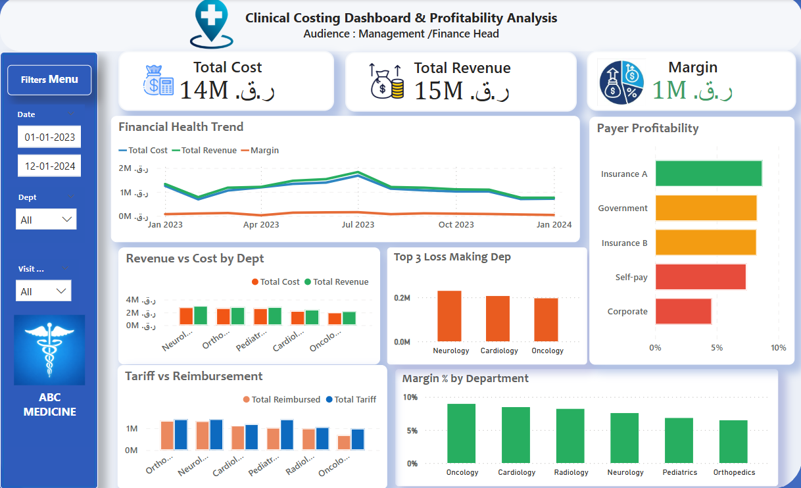
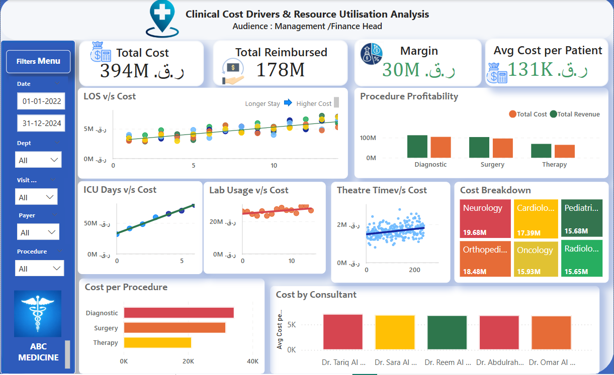
[🔗 View Dashboard](https://drive.google.com/file/d/1MSNlnj3d7DbgDg4BXIZuy5KlRVbe0FAQ/view?usp=drive_link)

###  Hospital Emergency Room Dashboard
- 🌍 Analyzed **9,000+ hospital emergency room records** using Power BI, developing DAX measures to evaluate key **operational KPIs** such as patient wait time, satisfaction, and referral volumes, supporting clinical performance and cost-related insights.
- 🔍 Transformed and validated healthcare activity data using **Power Query and DAX**, creating calculated fields (wait-time SLA, admission status, age groups) to improve data quality, ensure accurate reporting, and support downstream costing and reconciliation processes.
- 📈 Designed an interactive BI dashboard to analyze patient flow, demographics, and departmental activity, enabling data-driven decision-making for **resource planning, service optimization, and supporting clinical costing and pricing analysis**. 
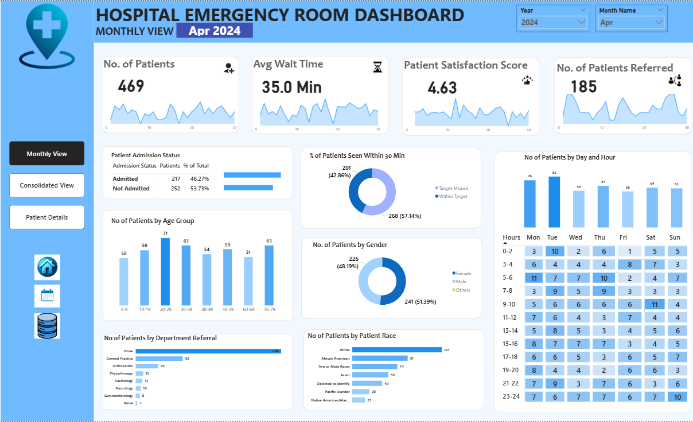
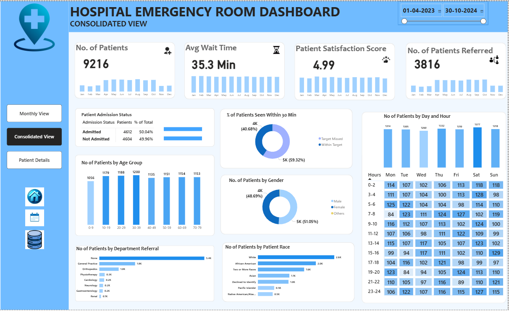
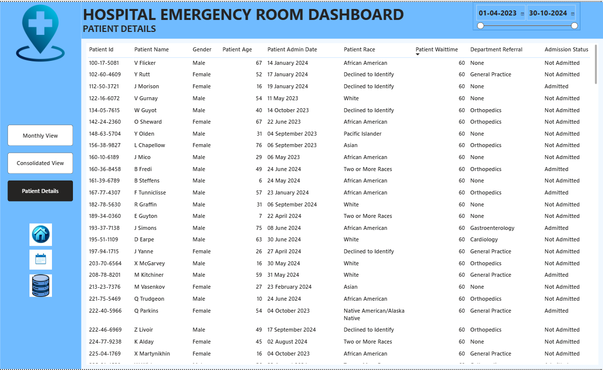
[🔗 View Dashboard](https://drive.google.com/file/d/1KgUWIozgAVKWNTPg4Uzhz42gVi0Wd38Q/view) 

###  Automotive Sales Dashboard
- 🌍 Designed and developed an interactive **Sales Performance Dashboard (2015–2025) in Power BI**, integrating multi-year sales, invoices, gross profit, and GP% KPIs with dynamic slicers for branch and year-level analysis.
- 🔍 Implemented advanced **DAX measures including YoY Sales Change, Gross Profit %, and branch-wise contribution analysis**, enabling real-time performance tracking and comparative insights.
- 📈 Built visually optimized reports with drill-down capabilities, **trend analysis**, and branch segmentation to support data-driven decision-making and executive-level reporting. 
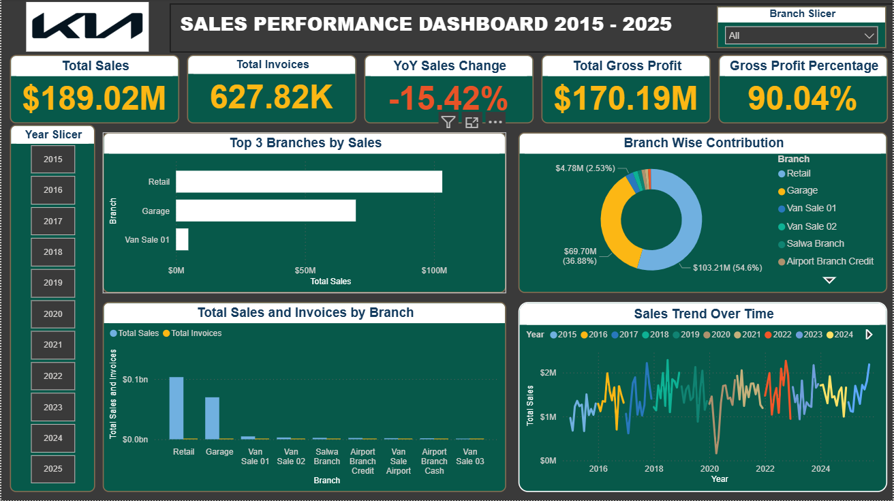
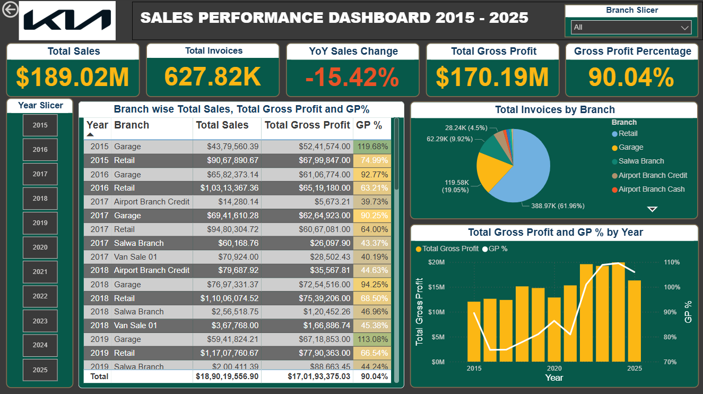
[🔗 View Dashboard](https://drive.google.com/file/d/1fBDHnRgwfiAzqKbf5_ytT9WYRucGpYwo/view?usp=drive_link)  

###  Holiday Package Purchase Prediction - Python
- 🌍 Built a machine learning model to predict customer likelihood of purchasing a newly introduced wellness tourism package using a Kaggle dataset with 4,888 records and 20 features..
- 🔍 Performed end-to-end data preparation, including missing value imputation, category standardization, feature selection, and exploratory data analysis to identify key customer behavior patterns.
- 📈 Improved business targeting insights by identifying high-potential customer segments, and selected KNN as the best-performing model after resampling and hyperparameter tuning. 
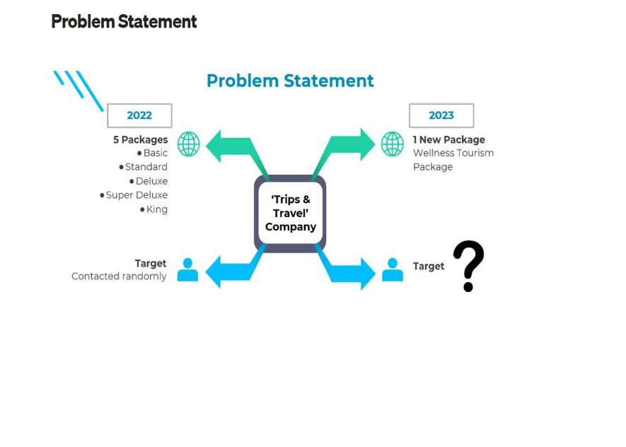
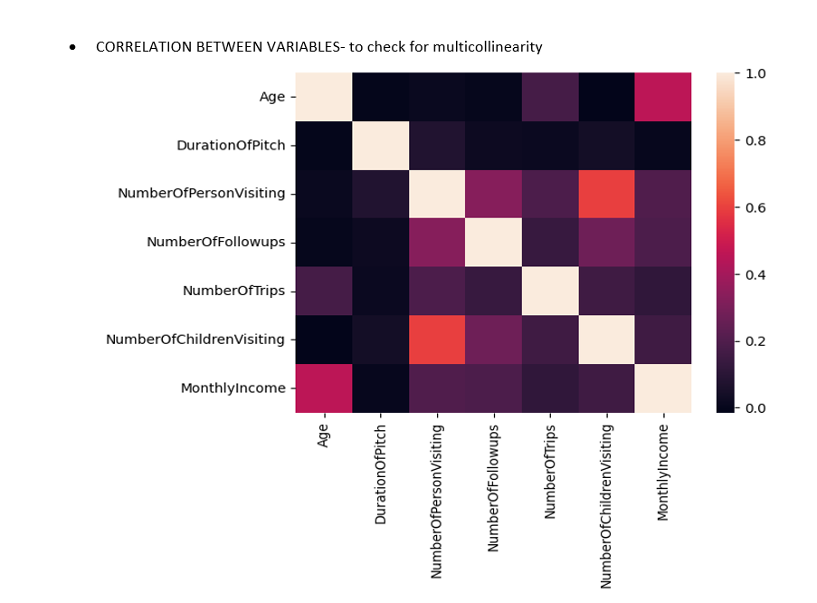
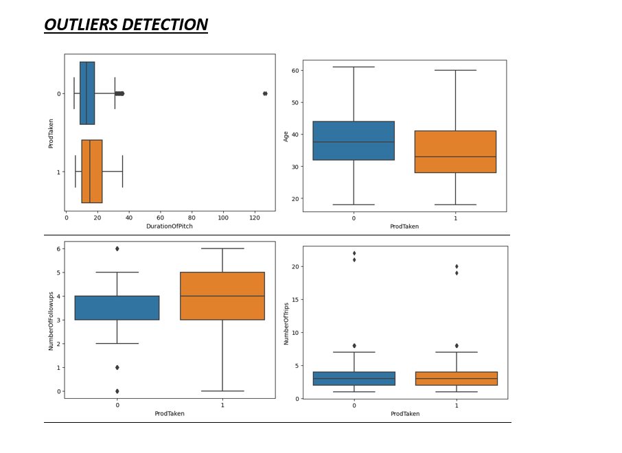
[🔗 View Dashboard](https://docs.google.com/document/d/1932wCVR9xCoW1_lQCXAE030E5clOlbNT/edit?usp=drive_link&ouid=114753895963624103709&rtpof=true&sd=true)  

---

###  HR Analytics Dashboard 
- 🌍 Designed an HR Analytics dashboard using **MySQL and Power BI** to analyse employee demographics, salary trends, departmental performance, and workforce health.
- 🔍 Built **SQL views with joins across multiple tables** to extract hire, resignation, payroll, and department-level data for KPI reporting and attrition analysis.
- 📈 Generated actionable insights on gender imbalance, high-paying departments, declining salary trends, and rising attrition, supporting data-driven HR decision-making 
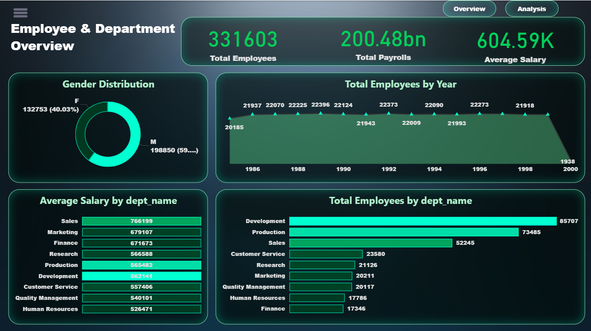
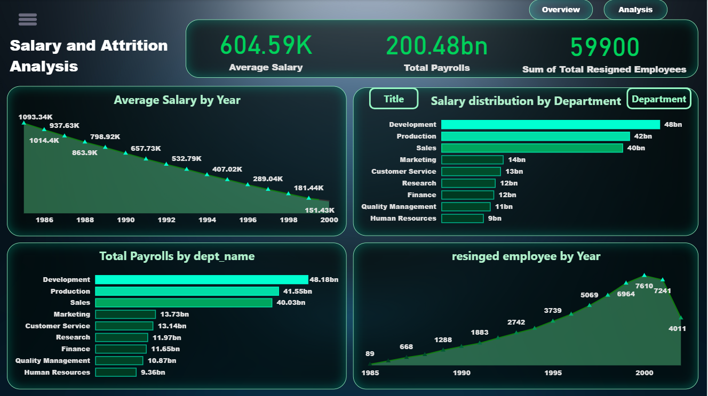
[🔗 View Dashboard](https://drive.google.com/file/d/1y96XybPgJqq8HcgUiSbDhblL27kVGCOI/view?usp=drive_link)
 
---

### CRM Sales Performance & Pipeline Analysis Dashboard  
- 🏨 Developed an interactive **Power BI dashboard analyzing 3,000+ CRM records totalling 8.2M+ in deal value**, providing insights on sales agent performance, conversion rates, and deal trends.
- 💡 Constructed **10+ DAX calculations** and data models to track KPIs including conversion rates, sales cycle durations, and product wise deal closures across multiple countries and industries.
- 📊 Delivered actionable, user-friendly visuals maps, funnels, bar charts, and scatter plots enabling data driven pipeline optimization and strategic sales decision-making. 
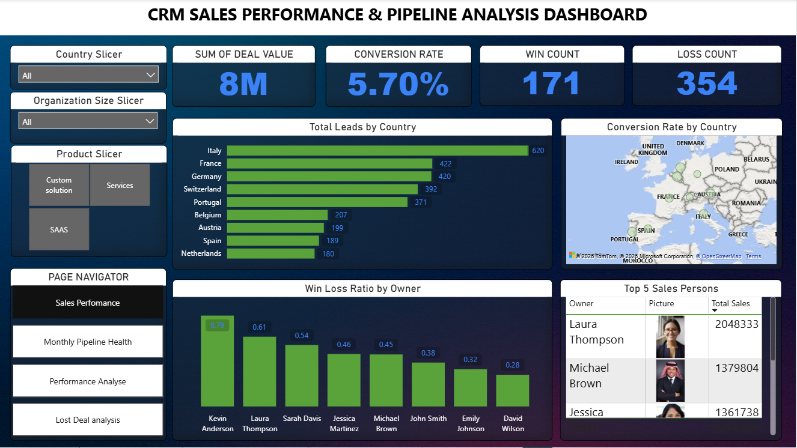
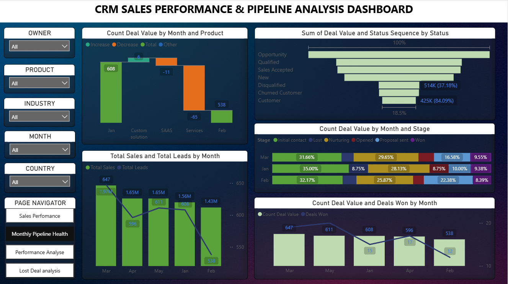
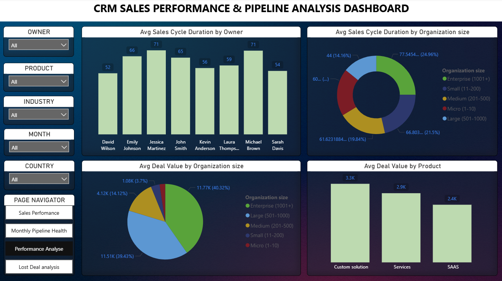
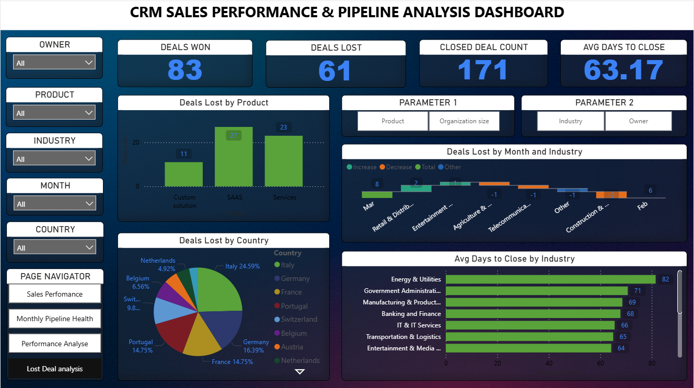
[🔗 View Dashboard](https://drive.google.com/file/d/1GAkpt6v-g8Vx6XCNHc-hH-20-p9UegxY/view?usp=drive_link)

---

###  Car Insurance Portfolio & Claims Analysis Dashboard  
- 🌍 Analyzed 37,541 car insurance policies using **Power BI, creating DAX measures to calculate total claim value of $1.88B and core portfolio-level KPIs**.
- 🔍 Cleaned and transformed insurance data in **Power Query**, correcting data types, resolving missing values, and **standardizing 10+ categorical variables** including coverage zone, car use, education level, vehicle make, kids driving, and car year to ensure analytical accuracy.
- 📈 Designed an interactive Insurance **Risk & Claims Analysis dashboard** using slicers and visuals to analyze policy distribution by gender, coverage zone, car use, vehicle make, and car year, supporting **data-driven insurance risk assessment**.
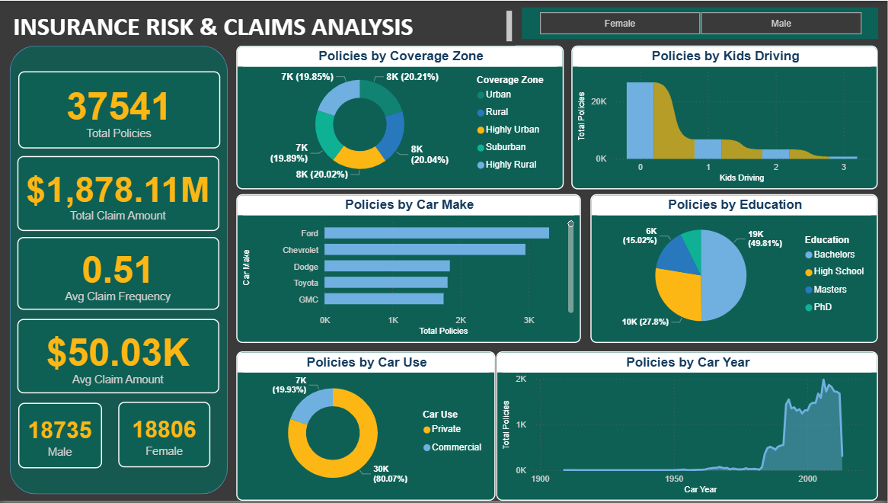
[🔗 View Dashboard](https://drive.google.com/file/d/1Focd_zXfJU6x8mdNEvLzM3N2cu-lz33y/view?usp=drive_link)

---

## 📜 Certifications  
- ✅ Python 3 Certification Course - Programming Hub 
- ✅ Complete Python Bootcamp- UDEMY (ongoing)
- ✅ JPMorgan Excel Skills Job Simulation Virtual Experience Program (Forage) 
- ✅ Wisssenaire IIT Bhubaneshwar Finance Certificate Course (Teachnook)

---

## 🧠 Tools & Skills  
 
 
 
    

---

## 📫 Contact Details  
*Let’s connect and see how we can make a difference together!*  

<table>
  <tbody>
    <tr>
      <td>📧</td>
      <td><a href="mailto:safadarwish2001@gmail.com">safadarwish2001@gmail.com</a></td>
    </tr>
    <tr>
      <td>📞</td>
      <td>(+974) 71365480</td>
    </tr>
    <tr>
      <td>📍</td>
      <td>Al Waab, Doha, Qatar</td>
    </tr>
    <tr>
      <td>⬇️</td>
      <td><a href="Nihal Abdulla Resume.pdf">Download my CV</a></td>
    </tr>
    <tr>
      <td>🌐</td>
      <td><a href="https://www.linkedin.com/in/safa-darwish-b361431a4?">Let’s connect on LinkedIn</a></td>
    </tr>
  </tbody>
</table>
